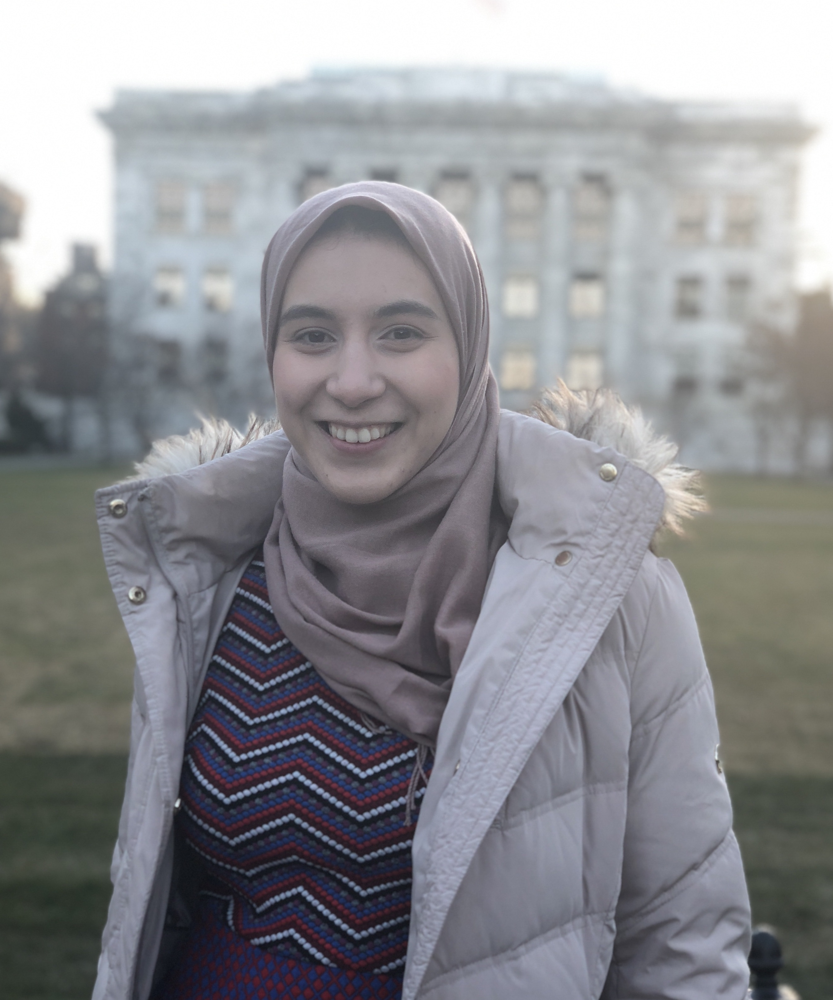

align:center"

I am a Ph.D. student in the Department of Genetics at Harvard Medical School in the lab of [Dr. Stephen Elledge](https://elledge.hms.harvard.edu/), where I work on engineering T-cells to enhance anti-tumor immunity.

### My Interests

Test

<!--  -->
